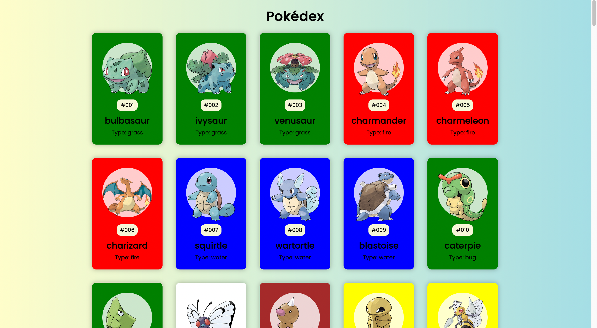

# Pokedex



#### project notes

1. HTML

- title: Pokedex
- card: image / id / name / types

2. CSS

- flexbox
- different bg color depending on the types(species.url => color.name) => used color url but the color here is based on the pokemon's body color, not its type.

3. JavaScript

- pokeapi by id
  `https://pokeapi.co/api/v2/pokemon/${id}/`
  `https://assets.pokemon.com/assets/cms2/img/pokedex/full/001.png`

* Challenge from Brad Traversy & Florin Pop on Udemy '50 Projects in 50 Days'

#### Takeaways from the instructor

1. HTML

- no header, just h1
- inline style for background-color
- image wrapped in a div and text(span, h3) wrapped in another div

2. CSS

- add solid background color with linear-gradient due to browser compatibility, but it seems all browsers support it.
- rgba

3. JavaScript

- image: https://pokeres.bastionbot.org/images/pokemon/1.png
- type: color in object

```
const main_types = Object.keys(colors);

const fetchPokemons = async () => {
  for ( let i = 1 ; i <= pokemon-count ; i++ ) {
    await getPokemon(i)
  }
}

const getPokemon = async (id) => {
  const url = `https://pokeapi.co/api/v2/pokemon/${id}`
  const res = await fetch(url)
  const data = await res.json()
  createPokemonCard(data)
}

const createPokemonCard = (pokemon) => {
  const pokemonEl = document.createElement('div')
  pokemonEl.classList.add('pokemon')

  const id = pokemon.id.toString().padStart(3, '0')
  const name = pokemon.name[0].toUpperCase() + pokemon.name.slice(1)
  const poke_types = pokemon.types.map(type = type.type.name)
  const type = main_types.find(type => poke_types.indexOf(type) > -1)
  const color = colors[type]
  pokemonEl.style.backgroundColor = color

  const pokemonInnerHTML = `
    ... img src=".../${pokemon.id}.png"

    ${id}
    ${name}
    ${type}
  `
  pokemonEl.innerHTML = pokemonInnerHTML

  poke_container.appendChild(pokemonEl)
}
```
